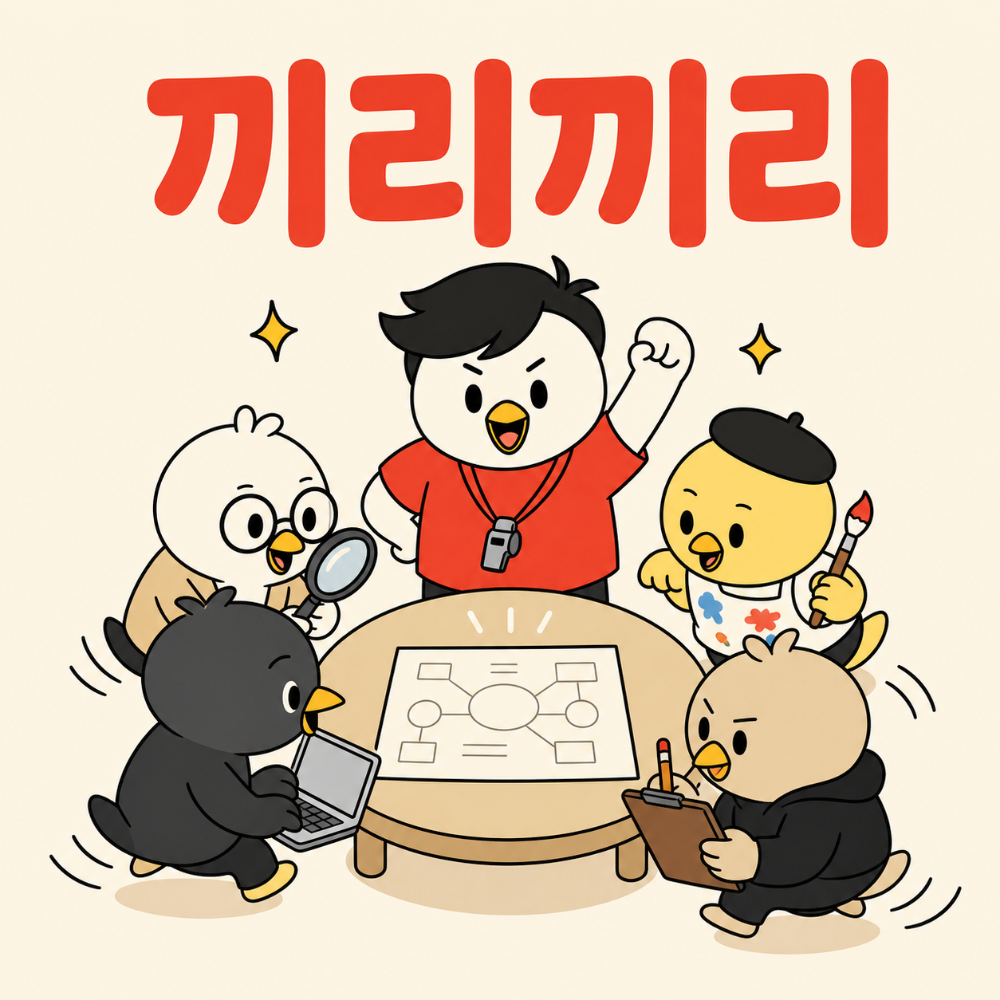

[English](README.md) | [한국어](README.ko.md) | [中文](README.zh.md) | [日本語](README.ja.md) | Español

# kkirikkiri (끼리끼리)

<p align="center">
  
</p>

> **Una sola frase. Un equipo de agentes de IA, montado y en marcha.**

Describe tu objetivo. kkirikkiri pregunta solo por decisiones pendientes y ejecuta el equipo o Workflow que apruebes, sin repetir información ya proporcionada.

Los registros por sesión y las comprobaciones de aceptación evitan confundir cambios incidentales con trabajo terminado. El [preparador opcional](skills/kkirikkiri/references/prepare-team-pilot.md) genera tarjetas y solicitudes Agent desde un plan aprobado; no es un sandbox de permisos.

[Inicio rápido](#inicio-rápido) • [¿Por qué kkirikkiri?](#por-qué-kkirikkiri) • [Cómo funciona](#cómo-funciona) • [Características](#características) • [Requisitos](#requisitos)

---

## Inicio rápido

### 1. Añade el marketplace

```
/plugin marketplace add https://github.com/fivetaku/gptaku_plugins.git
```

### 2. Instala

```
/plugin install kkirikkiri
```

### 3. Activa Agent Teams

```json
// ~/.claude/settings.json
{
  "env": {
    "CLAUDE_CODE_EXPERIMENTAL_AGENT_TEAMS": "1"
  }
}
```

### 4. Ejecuta

```
/kkirikkiri build me a research team
```

---

## ¿Por qué kkirikkiri?

- **Entra lenguaje natural, sale un equipo funcionando** —sin YAML ni definiciones de agentes que escribir a mano
- **Entrevista** — pregunta solo por información pendiente que cambia el resultado
- **Consciente del entorno** —detecta las herramientas instaladas (Codex CLI, Antigravity CLI `agy`, `.claude/agents/`) y monta el mejor equipo con lo que realmente tienes
- **Multimodelo** —Claude, Codex CLI (código y análisis a gran escala) y Antigravity CLI (diseño/UI) pueden asumir roles distintos dentro del mismo equipo
- **Dos sustratos de ejecución** —tú eliges: un equipo colaborando en vivo (Agent Teams) o una tubería de agentes determinista (Workflows) para trabajo masivo en paralelo
- **Validación** — termina al cumplir los criterios; máximo dos rondas por defecto y aprobación explícita para continuar
- **Memoria compartida** —los archivos de `.kkirikkiri/teams/{team_name}/` persisten entre rondas, así que un miembro de reemplazo retoma el contexto al instante; cada sesión usa su propio directorio para evitar colisiones entre sesiones simultáneas
- **Agentes reutilizables** —guarda a los miembros del equipo en `.claude/agents/` para usarlos en proyectos futuros

El nombre viene del modismo coreano **끼리끼리** —*los afines se juntan de forma natural*. Cada equipo se monta en torno a un propósito compartido.

---

## Cómo funciona

```
Natural language input
    → Step 1: Intent detection + preset matching
    → Step 2: Environment scan (parallel)
    → Step 3: Interview — missing consequential decisions only
    → Step 4: Dynamic team composition
    → Step 5: Team proposal + your confirmation
    → Step 6: Shared memory init + team execution
    → Step 7: Quality validation (two rounds by default; approved extensions only)
    → Step 8: Result collection + report
```

**Reglas del líder del equipo:**
- La sesión anfitriona coordina por defecto; un Leader separado se añade solo con aprobación
- El líder planifica, delega y valida; nunca escribe código directamente
- Cada miembro tiene un rol con un alcance estrictamente acotado

---

## Características

### Presets

Cinco presets integrados con coincidencia de disparadores en lenguaje natural:

| Preset | Palabras disparadoras | Equipo por defecto |
|--------|--------------|--------------|
| Investigación | investiga, busca, consulta, compara | Líder + 2 investigadores |
| Desarrollo | construye, implementa, programa, añade una función | Líder + 2 desarrolladores |
| Análisis | analiza, revisa, inspecciona, audita | Líder + 2 exploradores |
| Contenido | escribe, documento, README, entrada de blog | Líder + redactor + revisor |
| Producto/PM | PRD, estrategia, roadmap, OKR, GTM | Líder + PM + investigador |

Los presets son un punto de partida. La entrevista y el escaneo del entorno dan forma al equipo final cada vez.

### Memoria compartida

El equipo escribe en `.kkirikkiri/teams/{team_name}/` en la raíz de tu proyecto (con alcance por sesión, sin colisiones entre sesiones concurrentes):

| Archivo | Propósito |
|------|---------|
| `TEAM_PLAN.md` | Plan de tareas, asignación de roles, objetivos |
| `TEAM_PROGRESS.md` | Progreso en vivo: elementos completados y pendientes |
| `TEAM_FINDINGS.md` | Hallazgos y callejones sin salida (`DEAD_ENDS`) |
| `report.md` | Informe final canónico de esta sesión |

Los equipos guardados se almacenan entre sesiones en `.kkirikkiri/shared/saved-teams/`. Si un miembro es reemplazado a mitad de tarea, el nuevo lee estos archivos y se pone al día de inmediato.

### Bucle de validación

| Ronda | Estrategia |
|-------|---------|
| Ronda 1 | Ejecuta el equipo original |
| Ronda 2 | Juicio automático: mantener (A) / reemplazo total (B) / cambio parcial (C) |
| Rondas adicionales | Requieren aprobación; se corrigen solo los criterios pendientes |

### Soporte multimodelo

Claude + Codex CLI (código y análisis a gran escala, revisión entre modelos) + Antigravity CLI `agy` (diseño/UI) pueden asumir roles distintos dentro del mismo equipo. kkirikkiri detecta automáticamente qué está instalado y optimiza en consecuencia. Si no hay CLIs externos, funciona perfectamente solo con Claude.

### Detección automática y reutilización de agentes

Si `.claude/agents/` contiene definiciones de agentes, kkirikkiri las detecta y recomienda las relevantes para cada preset:

| Preset | Agentes de ejemplo |
|--------|---------------|
| Investigación | insane-research, data-analyst |
| Desarrollo | code-reviewer, architect |
| Análisis | code-analyzer, security-reviewer |
| Contenido | writer, translator |

Tras una ejecución exitosa, puedes guardar a los miembros que rindieron bien en `.claude/agents/` para reutilizarlos en otros proyectos.

### Estabilidad de arranque

Si un miembro del equipo no consigue incorporarse:
1. Se reintenta una vez con la misma configuración
2. Se reintenta con un modelo de nivel inferior
3. Se continúa con el resto del equipo

### Guardar y recargar equipos

```
/kkirikkiri use the research team from last time
```

---

## Requisitos

### Obligatorio

- **Claude Code** (última versión)
- **Flag de la función Agent Teams:**
  ```json
  // ~/.claude/settings.json
  {
    "env": {
      "CLAUDE_CODE_EXPERIMENTAL_AGENT_TEAMS": "1"
    }
  }
  ```
- **Node.js** (para las integraciones con CLIs externos)
- **tmux** (opcional): solo para mostrar el equipo en paneles divididos. Sin él, los equipos funcionan en el propio proceso. `brew install tmux` (macOS) / `apt install tmux` (Linux)

### Opcional (multimodelo)

```bash
npm install -g @openai/codex                                    # Codex CLI — code & large-scale analysis, cross-model review
curl -fsSL https://antigravity.google/cli/install.sh | bash     # Antigravity CLI (agy) — design/UI
curl -fsSL https://x.ai/cli/install.sh | bash                  # Grok CLI (código, revisión cruzada de contexto largo)
```

Funciona sin ellos. Claude se encarga de todo el equipo por sí solo.

### Referencia de costes

| Tamaño del equipo | Tiempo estimado | Nivel de coste |
|-----------|---------------|-----------|
| 2–3 miembros | 5–15 min | Bajo |
| 4–5 miembros | 10–30 min | Medio |
| 5+ miembros, varias rondas | 30 min–1 h | Alto |

Reduce el tamaño del equipo o usa Codex/Antigravity CLI para bajar los costes.

---

## Licencia

MIT

---

<div align="center">

**Agentes afines, reunidos en torno a tu objetivo.**

</div>
